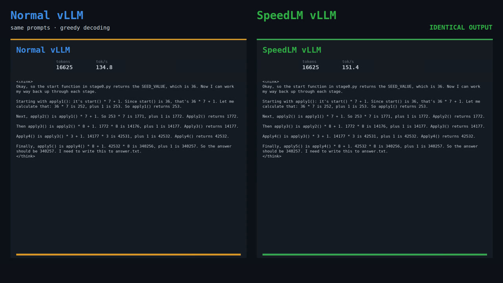

# SpeedLM

  

  <a href="docs/assets/speedlm-demo.mp4?raw=1"><strong>▶ Watch the 63-second demo</strong></a>
   
  
    Authentic vLLM, curl, capture, idle, and training output. The recording uses a
    five-second demo idle threshold; the default is five minutes.
  

SpeedLM wraps <code>vllm serve</code>, captures the traffic your deployment
already receives, and uses idle GPU time to tune an existing speculative draft.
The OpenAI-compatible API stays the same.

- **Serve normally.** Requests stream through a small gateway to a real vLLM
  process.
- **Learn from real traffic.** Completed inputs and outputs become bounded,
  redacted training traces.
- **Tune only while idle.** A candidate draft must beat the current draft on a
  held-out gate before SpeedLM promotes it.

> **Research preview:** the complete live path has been exercised on H100s.
> Other GPU/runtime combinations are not yet claimed as supported.

## Quick start

### 1. Prerequisites

Use a Linux NVIDIA host with:

- Python 3.12
- a working <code>vllm serve</code> installation in the same Python environment
- enough local disk for traces, hidden states, and model artifacts

The live-tested stack is vLLM 0.25.1+cu129, PyTorch 2.11.0, CUDA 12.9, and
[Speculators v0.6.0](https://github.com/vllm-project/speculators/releases/tag/v0.6.0).
CUDA, PyTorch, vLLM, model weights, and Speculators are intentionally installed
out of band because their packages depend on the GPU host.

### 2. Install the wrapper

Run this inside the Python 3.12 environment where vLLM already works:

~~~bash
git clone https://github.com/RyanKim17920/speedlm.git
cd speedlm
python -m pip install .

speedlm --version
speedlm doctor
~~~

There is no <code>curl | bash</code> installer yet. A script that installs only
the lightweight wrapper while leaving the CUDA and training runtimes unresolved
would report success too early. A tagged package or CUDA container is the right
next distribution step.

### 3. Serve and capture

Replace <code>vllm serve</code> with <code>speedlm vllm serve</code>:

~~~bash
speedlm vllm serve Qwen/Qwen3-8B \
  --host 0.0.0.0 \
  --port 8100 \
  --max-model-len 16384
~~~

Arguments SpeedLM does not consume are forwarded to vLLM, so existing options
such as tensor parallelism and GPU-memory utilization still work.

Send the same OpenAI-compatible request you would send to vLLM:

~~~bash
curl http://localhost:8100/v1/chat/completions \
  -H "Content-Type: application/json" \
  -d '{
    "model": "Qwen/Qwen3-8B",
    "messages": [
      {"role": "user", "content": "Explain speculative decoding in one sentence."}
    ]
  }'
~~~

At this point SpeedLM is serving and capturing traffic, but it is **not
tuning**.

## Turn on idle tuning

Idle tuning warm-starts from an existing public draft head; it does not train a
speculator from scratch. First install
[Speculators](https://github.com/vllm-project/speculators/blob/main/docs/user_guide/getting_started.md),
then copy the portable Qwen configuration:

~~~bash
mkdir -p "$HOME/.speedlm"
cp configs/qwen3-8b-eagle3.example.json "$HOME/.speedlm/config.json"
~~~

Edit these three values in <code>~/.speedlm/config.json</code>:

1. <code>tuning.speculators_repo</code>
2. <code>tuning.training_python</code>
3. <code>tuning.vllm_python</code>

Then validate and launch:

~~~bash
speedlm doctor

speedlm vllm serve Qwen/Qwen3-8B \
  --enable-idle-tuning \
  --max-model-len 16384
~~~

After setup, <code>--enable-idle-tuning</code> is the only serving change. The
explicit <code>--max-model-len 16384</code> keeps the serving and training
context windows aligned with the example.

If your traffic includes tools, multi-turn history, or client-supplied assistant
turns, declare that in the config's <code>workload</code> section before
tuning. SpeedLM measures the captured corpus and warns when the declaration
does not match it.

### What happens when traffic stops

1. The gateway waits for five quiet minutes by default, plus two confirmation
   polls.
2. It closes admission, drains accepted requests, and puts vLLM to sleep.
3. SpeedLM snapshots traces, extracts training signals, trains a candidate, and
   benchmarks it on a session-disjoint held-out suite.
4. It promotes only a candidate that clears the accepted-length and throughput
   safeguards; otherwise it restores the incumbent.

A request arriving during this cycle waits at the gateway, preempts work where
safe, and runs only after a verified draft is awake. It is never sent to a
sleeping engine or partially trained weights. The server-side wait is currently
unbounded, so clients should keep a timeout appropriate for a possible engine
restore.

Check the live state and measured result with:

~~~bash
speedlm status
speedlm traces stats
speedlm gain
~~~

## Measured result

On Qwen3-8B agentic coding traffic, the session-disjoint gate measured:

| | Stock draft | Idle-tuned draft |
| --- | ---: | ---: |
| Accepted tokens per verifier step | 2.3051 | 2.6507 |
| Relative change | — | **+15.0%** |
| Contexts × repeats | 287 × 8 | 287 × 8 |

That acceptance-side result is reproducible. Wall-clock throughput for the same
two heads ranged from +9.9% to +19.9% across shared-node gates, so SpeedLM does
not present a universal “15% faster” claim. The most repeated gate measured
+16.15% throughput but correctly vetoed that timing channel as non-stationary.
See [the current result](docs/agentic-selfplay-result.md) and
[the speedup ceiling analysis](docs/speedup-ceiling.md).

The verifier still decides every emitted token. A different draft changes how
much work the verifier can accept per step, not the target model's intended
distribution. Exact bytes are not guaranteed across independently batched vLLM
runs, even at temperature zero.

## Built-in profiles

| Profile | Verifier | Idle tuning |
| --- | --- | --- |
| <code>qwen3-8b-eagle3</code> | <code>Qwen/Qwen3-8B</code> | EAGLE-3 |
| <code>llama-3.1-8b-instruct-eagle3</code> | <code>meta-llama/Llama-3.1-8B-Instruct</code> | EAGLE-3 |
| <code>gpt-oss-20b-eagle3</code> | <code>openai/gpt-oss-20b</code> | EAGLE-3 |
| <code>qwen3.5-9b-mtp</code> | <code>Qwen/Qwen3.5-9B</code> | Not yet training-wired |

Plain proxy serving can launch other models. Idle tuning requires a compatible,
trainable profile and warm-start draft.

## Data and safety

State defaults to <code>~/.speedlm</code> and can be moved with
<code>SPEEDLM_HOME</code> or <code>--home</code>:

~~~text
~/.speedlm/
  exchanges/  exact request/response bytes; private directory
  traces/     bounded normalized training traces
  profiles/   custom model profiles
  runs/       training, gate, and promotion artifacts
~~~

Normalized traces apply configured redaction. Exact raw exchanges can still
contain credentials, system prompts, user data, and model output; protect and
retain them according to your deployment's data policy.

## Documentation

- [Architecture and request lifecycle](docs/architecture.md)
- [Configuration index](configs/README.md)
- [Current benchmark result](docs/agentic-selfplay-result.md)
- [Why the measured ceiling is about 15%](docs/speedup-ceiling.md)
- [Benchmark evidence](docs/benchmark-evidence.md)
- [GPU E2E harness](docs/e2e-harness.md)
- [Documentation index](docs/README.md)

## Development

~~~bash
uv sync --frozen --extra dev
uv run pytest -m "not e2e"
uv run ruff check .
uv run mypy
~~~

GPU E2E tests are opt-in; CPU CI reports them as skipped rather than silently
deselecting them. See [CONTRIBUTING.md](CONTRIBUTING.md).

## License

SpeedLM is available under the [MIT License](LICENSE).
